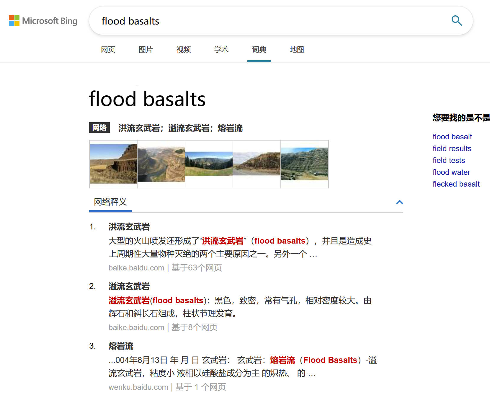
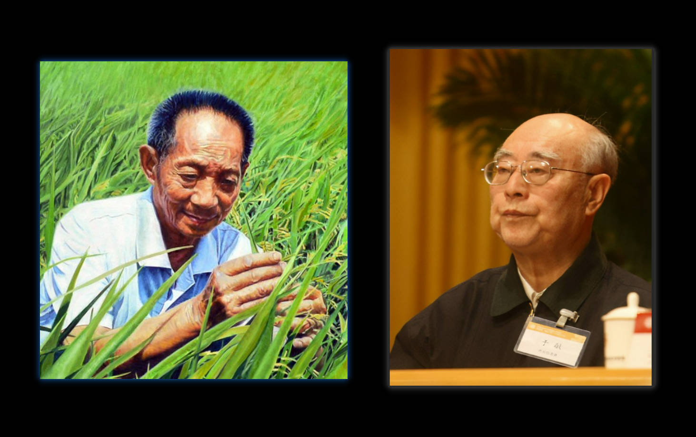

# 科研生活，还有未来

不知不觉已经硕士研究生快一年了，上半学期充实在各式各样的课程中，下半学期则开始Dupal异常的研究。

不得不说，上半学期，是我生命里最忙碌且充实的时期。不仅有每周充满了的课程，更有复垦压覆工作上的内容，当然还有些对家庭的烦恼。

但还好，上半学期就这么过来了，毕竟这样的生活以前也面临着，有经济压力，学习压力，工作压力。这并 **不稀奇** ，只不过是生活较为充实。

然而，下学期开始，逐渐的就不适应了。

工程工作基本已经结束，课程也基本结束。只是单纯地完成关于Dupal异常的研究，却让我有许多头疼的点。

## 外文文献阅读与科研基础

其痛苦之处并不是看不懂，实际上现在的翻译工具下，“看懂”并不难，但看“清楚”并不容易。

以往本科学习的许多专业的中文词汇，对不上那不同语系下的英语。

就比如，溢流玄武岩(**flood basalts**)，翻译软件翻译出 (**洪水玄武岩**)。当然知道这是有问题的，但是看见词汇依然不晓得具体意思。

甚至有些时候在搜索上也不能找到唯一的翻译，百度翻译显然有些时候不行。

当 flood basalts 翻译为熔岩流、溢流玄武岩的时候，自然还是能了解含义的。
当翻译成洪水玄武岩时，就不明所以了，虽然就英语原文来看，这样的翻译貌似并没有什么问题？

> Flood basalt is formed by an eruption or series of eruptions of large volcanic episodes that cover vast stretches of land or ocean floor with flows of mafic igneous rocks (basalt lava flows). A flood-basalt province is popularly known as Trap (Deccan Traps in India).

这种情况，显然是学术界的约定俗成和机械翻译的区别。我个人看来，长久尺度来看，人并不如机械可靠，这个问题自然会在大量阅读后逐渐消失。

> 但我想，或许未来全部交给翻译AI是更好的选择。

就比如盒须图、箱线图（*box-and-whisker plot*）这样的没有那么明确的问题。想要统一，自然需要一个恒定的标准。

不同学科不同标准的话，只不过是加大了沟通的难度罢了，并不利于知识的发展。

## 理想科研与骨感生活

我本科属于地质大类，专业是资源勘查工程（固体矿产），虽说研究生本来大部分东西都要自主学习，平时能明显感觉到了本科基础的影响。

Dupal异常是属于地化方面的内容，恰好我本科《现代化学基础》和《地球化学》两门课都是60多分的选手，属实是有些令人感叹。

终究是要走向本科最不行的方向？

我本人并没有什么偏好的学科，科研更像是一种“工作方式”，无论是研究地质还是海洋，我既谈不上非常感兴趣，也并不能说完全不感兴趣。总的说来，应该只是顺水推舟一样的事情罢了。

> 所以我对科研的态度就是想为人类做出一丁点的贡献罢了。

我自知并没有特别高深的才能，也不是特别强势的才子。

不像数学韦神那般传奇，不及两弹一星的科研工作者那般刻苦。

我的偶像是袁隆平，于敏这些为国为民做出大贡献者。

加上本人并没有太大的物质追求，能做出小小的贡献，便是我的奢望了。

## 科研与论文

说起科研，在现在这个时代就不得不提 ~~论文~~ 。

和我朴实的想法一样，我对论文这样的东西并没有太大的想法。

在我看来，做出三峡大坝比写多篇高级别的文章更有意义。虽然这样的比较是有点有失偏颇的，可能是我对论文的意义尚不明确吧。

但总的来说，我应该是更偏向于做有实际成果的工作。

毕竟，地质的东西，很多时候只是一个玄学般的设定？我们既不能经历历史变迁看到地质过程的演化，目前也不能打穿地壳看看这地球的实际状态。

仅仅从地形，少量石头上面，用元素推测，模型假说，总让我不是那么“相信”。

哪怕也没有更好的解释了解方法了。

以我粗浅的学识来看，地质是随着观测技术的进步而进步着的。而技术进步往往也就意味着实际的工作成果，而不是假说理论。

往往证实了的理论，才是合格的。而地质的问题在于，你费劲心思证明的东西，可能也不是实际，随随便便的假说，你也不能证伪。

> 不愧是玄学。

### 论文与套路

很明显，发论文是有套路的，汇报什么的也是。

在对论文有了怀疑后，更加对这样的套路有了不适。

最近看的都是些高级别的文章，许多文章的页数也是十几页往上。几千字的内容里，想说明几个问题，想说好一个故事，也并不容易。

最近的我也是苦恼于这样的文献阅读中，虽然我也知道，要有输入，这样才能输出。

但我往往总感觉，只是在知识的复杂化？或者说，让知识逐渐远离寻常。

就拿Dupal异常来说，在铅同位素的基础上，划出参考线，设定出基于铅同位素而又不同于铅同位素的指标。

在改变了数据结构之后，加以限定，然后令其贴合地质背景，以此加以解释。

貌似合情合理，却也让人不禁怀疑，用多次改造后的数据，再加以限定后，以此来做指标解释，难道不都可以么？

还有就是那些几十页的论文，很多时候都令我难受，为什么这么复杂呢。

按理说，地质想解决的，想说明的事情应该是简单的。

我以为，可以用一句话说明白，用一段话说清楚，用三段话说完整，用一篇文说透彻。

标题，摘要，简介及结果，论文本身四样层次。

可能是语言障碍让我不能很好的领悟吧，又或许是别的原因。

希望“玄学”也是简洁的，而不是 [逆奥卡姆剃刀](https://www.nature.com/articles/s41567-022-01575-2) 的。大道至简应该还是没错的。

## 心态

这学期的心态其实不太好，有点掉头发。我个人的性子一直都是随和的，有几分不以物喜不以己悲的样子。

一直以来也是这样，哪怕考研那个把月，也一样，从不会因为什么学业压力有什么影响。

毕竟，心态挺好的，又或者说，没心没肺的。

可这研一下学期属实有点绷不住，现在想来，我也不晓得有啥压力什么的。

老师这边虽然是提出了些意见，大体是作图要用工，最好能直接看，汇报PPT要尽量美观，标题什么的要做好。

我也能理解老师的意思，不要拿半成品来找他沟通，实际上是有点浪费时间的，PPT汇报则是希望我养成习惯，这样以后可以轻轻松松的就汇报。

我一开始以为是老师这些批评让我心态不佳，现在回想起来，并不是。

最初只是对老师这些关注点不理解罢了，汇报上的不顺畅实际上也没有影响到太多东西。

平时实际上也没啥事做，不搞Dupal研究，日子也是挺无聊的。

目前看来，我心态的不好可能是：

1. 杭州饮食并没有那么好，我在杭州住的不习惯
2. 研究Dupal的路上，免不了困顿
3. 对未来的迷茫吧

还是非常迷茫的，现在的我，关于读不读博，关于以后工作等等。

> 未来似乎很美好，又似乎太过迷茫了。

2022年5月24日 17点01分
