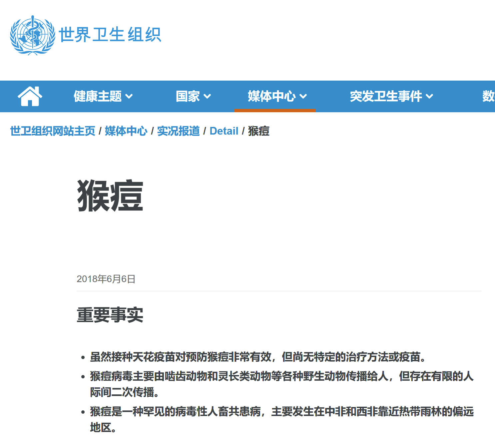

# 疫情与未来

> 疫情当下，对未来的感想，纯属闲聊

2022年05月，已经是2019年12月新冠爆发过去近两年半了，大体是我的大三大四和研究生生活阶段。

很清晰地体验到疫情前和疫情后大学生生活的变化，也见识到疫情对社会的重大影响。

其实传染病爆发在历史的长河上并不稀奇，黑死病，天花，非典等等，过去的人们抗争，现代的人们也在抗争。

> 能否从历史中吸取教训，可能才是过去和历史的区别。

显然，在新冠肺炎这次疫情的抗击上，中国是做得不错的。只不过目前上海的状况似乎有待提升。

## 新冠与现在

就事论事而言，组织好人们抗击疫情，说难也难，说简单也简单。我认为，很大程度上来说，就是代价问题。

愿意付出停工停产的，经济停滞的风险，将人们关在家里，断绝传染。这自然是可以控制住疫情。

代价是不小的，也并不是所有人都能承担得起。或许在我们关注不到的阴影里，有那么多人就像从没来过一样。

无论是在成都还是在杭州，我都经历了防疫措施，现在也基本上是常态化做核酸。

这显然是一种行之有效的手段，只要能包吃住，基本可以控制住所有的传染病问题。

控制住后，就是治疗问题，新冠传染性强，但好在致死率不高，所以到现在也相对不是那么大的死亡数。

总的来说，现在虽然在疫情的影响下，但仍旧是欣欣向荣的，未来也让人觉得是光明的。

在国内，新冠暂且可以翻篇，可最近又爆出猴痘。接二连三的问题，总是让人有些不安。

## 猴痘与未来

2022年猴痘疫情最先被英国在当地时间2022年5月7日发现。

当地时间5月20日，随着欧洲确诊和疑似猴痘病例超过100例，世界卫生组织确认就猴痘召开紧急会议。

不说美国在跑掉的猴子中扮演了什么角色，也不联想它生物实验室和新冠的问题。

眼光放到未来，或许疫情，传染病将会是常态。

或许美国人本身对此并不感冒，毕竟他们那有 [直播枪击](http://www.news.cn/mrdx/2022-05/16/c_1310594332.htm) 的地方。

本人不幸看过一些直播片段，若是代入无辜路人，那是相当的恐怖😱。你在路上走着走着就无了。

这些暂且不提，就现在这病毒发展的劲头，很难不让人担忧起世界末日，丧尸围城这样的灾难篇章。

相比起地质灾害，地震，海啸，火山爆发。我感觉疫情这样的“人祸”，更像是人间地狱。

毕竟要是外星人入侵，地球爆炸，人类甚至都没有反抗的机会，那就只能说声认命。

可传染病就像无差别攻击的子弹，活着活着，就告诉你，很快你就无了。可不就类似于这枪击案里的无辜路人么。

## 人类与末日

要是真的有类似于丧尸病毒一般的东西，或许现在的大白就是对抗丧尸的前线了。

虽然，大概率上由人转化出来的丧尸应该会在现代化的枪炮下变成碎片，其传染自然也会被控制下来。

但不安的生活，难免杞人忧天。若是丧尸爆发，海啸，地震一起来，地球上的人，十不存一。

末日下的人类，还有路么？

又或者说，世界上就剩你一个人，人类已经没希望了，你还要继续嘛？

在这层面上，突然让我感受到个体与集体的不同，又或者说人类与人的关系。

人终有一死，或许轻重不是问题，而是孤独？

当世界只剩你，看不到未来的时候，又该何去何从？

2022年5月24日 17点55分
