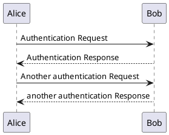

# 测试内容{docsify-ignore}

## 测试加入其他类型文件

```python
print()
```

插入 html 文件

<iframe width="100%" height="700px" src="/Page/Test/test.html"></iframe>

## Emoji 列表

### 小人

:relaxed:
:smirk:

:stuck_out_tongue:
:sleeping:

:pensive:
:disappointed:
:confounded:

:rage:
:triumph:
:sleepy:
:yum:
:mask:

:cupid:

:dash:
:sweat_drops:
:ear:
:eyes:

:rage1:
:rage2:
:rage3:
:rage4:
:suspect:

### 自然

:sunny:
:umbrella:
:cloud:
:snowflake:

:tiger:
:koala:
:bear:

:octopus:
:tropical_fish:
:fish:

:fallen_leaf:
:herb:
:mushroom:
:cactus:
:palm_tree:

:waxing_crescent_moon:

:volcano:
:milky_way:
:partly_sunny:
:octocat:

### 物体

:bamboo:
:gift_heart:
:dolls:

:gift:

:minidisc:

:nut_and_bolt:
:hammer:
:seat:

:package:
:door:
:smoking:
:bomb:
:gun:
:hocho:

:microscope:
:telescope:

:trophy:

:black_joker:

:boot:
:shirt:
:tshirt:
:necktie:
:womans_clothes:
:dress:
:running_shirt_with_sash:

:pouch:
:purse:

:curry:
:fried_shrimp:
:bento:

:candy:
:lollipop:
:honey_pot:
:apple:
:green_apple:
:tangerine:

:eggplant:
:tomato:
:corn:

### 地点

:house:
:house_with_garden:

:ferris_wheel:
:fountain:

:suspension_railway:
:mountain_cableway:
:tractor:

:moyai:

:kr:
:cn:

:uk:
:de:

### 符号

:one:
:two:
:three:
:four:
:five:
:six:

:arrow_double_down:
:arrow_double_up:

:arrows_clockwise:
:arrows_counterclockwise:
:rewind:
:fast_forward:
:information_source:

:u7a7a:
:u7981:

:ideograph_advantage:

:no_pedestrians:
:children_crossing:
:no_entry:
:eight_spoked_asterisk:

:clock430:

:clock8:

:heavy_check_mark:

:large_blue_diamond:
:large_orange_diamond:

### 国旗

:cn:
:checkered_flag:
:triangular_flag_on_post:
:black_flag:
:white_flag:

## plantuml 测试


